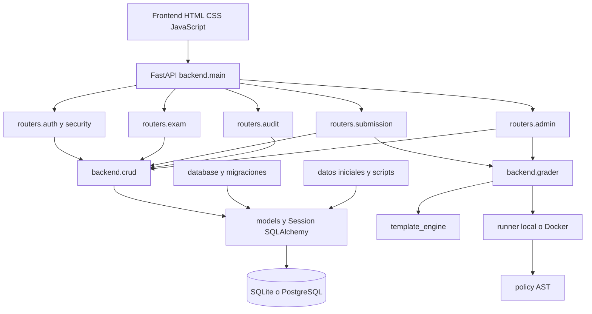
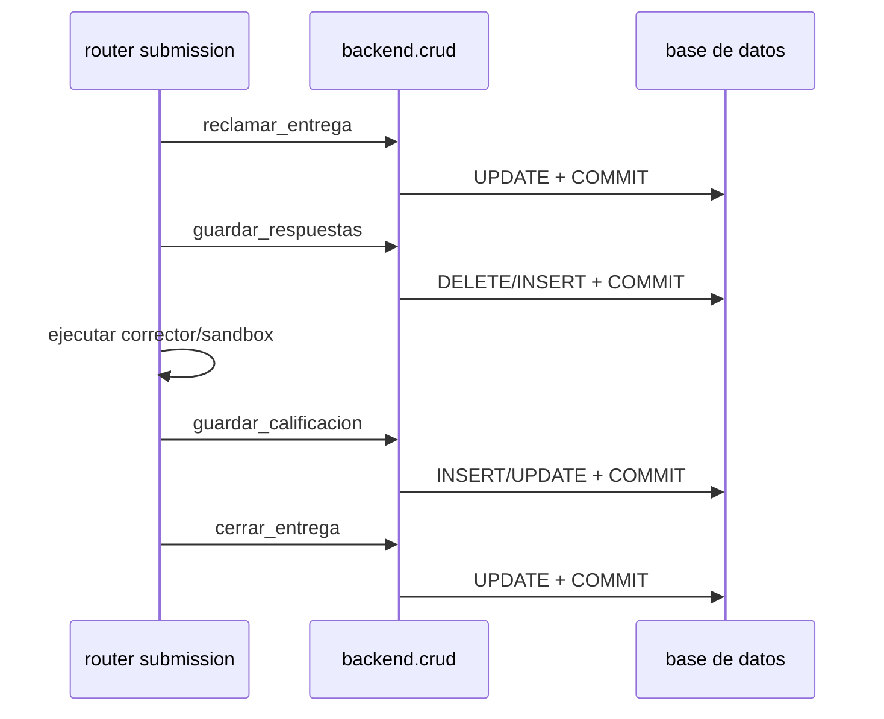
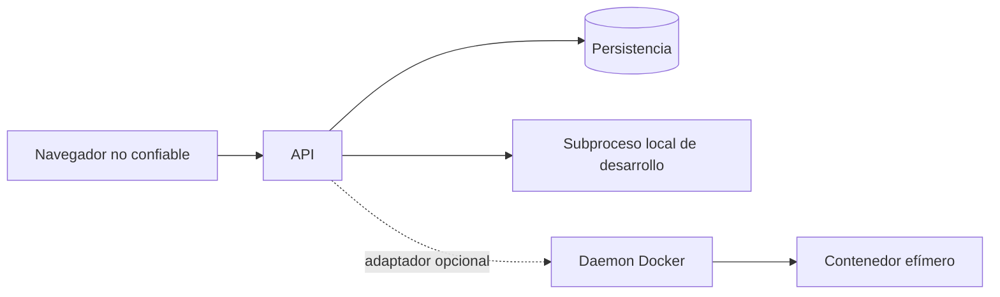

# Grafo de dependencias

El grafo se obtuvo de los imports y de las llamadas observadas en el commit inicial.
Las flechas indican dependencia en tiempo de ejecución.

## Dependencias relevantes para el orden de cambio

| Nivel | Módulos | Consumidores principales | Estrategia |
| --- | --- | --- | --- |
| 0 | `config.py`, `errors.py`, `sandbox/policy.py` | Todo el backend | Cambios pequeños y pruebas unitarias |
| 1 | `models.py`, `migraciones.py`, `database.py` | CRUD, routers, scripts, pruebas | Migraciones compatibles antes de usar nuevos campos |
| 2 | `crud.py` y nuevos servicios de aplicación | Todos los casos de uso | Sacar el control transaccional de auxiliares compuestos |
| 3 | `grader.py`, runners | Envío y revisión | Mantener ejecución fuera de transacciones largas |
| 4 | Routers | API pública y frontend | Añadir contratos sin romper rutas existentes |
| 5 | Frontend | Navegador | Integrar borradores y flujos multimedia tras estabilizar API |
| 6 | Scripts, CI y documentación | Reproducción | Ejecutar y registrar el sistema final, no una arquitectura supuesta |

## Límite transaccional inicial

El objetivo es conservar una reserva breve, ejecutar el sandbox sin transacción
abierta y transferir la fase final a un servicio que sea dueño de un único
`BEGIN/COMMIT/ROLLBACK`.

## Fronteras de confianza iniciales

La API usa directamente el cliente Docker cuando se activa. No existe todavía un
trabajador independiente ni se ha validado el daemon de esta máquina.
